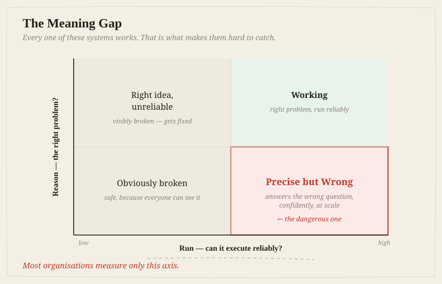
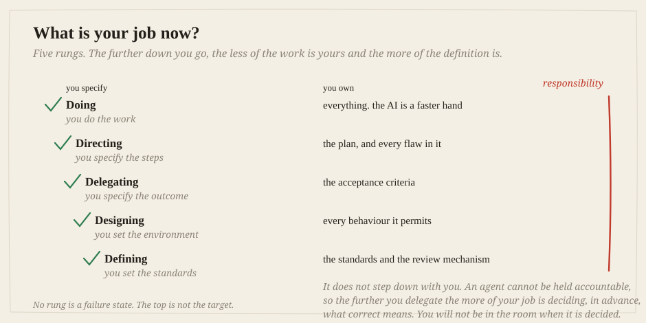

<div align="center">

# Nice to meet you. I'm Mario Lazo

**I help enterprises turn AI and data investments into operating change that executives can fund, govern, and scale.**

[](https://www.linkedin.com/in/mariolazo/)
[](https://a.co/d/08QZ6bfp)
[](https://github.com/MarioLazo/agentic-coe)

</div>

---

## Most people think production AI fails for technical reasons

It usually does not, and the reason is more uncomfortable than *"the model was
not good enough."*

Across **623+ case studies** and **65+ practitioner interviews**, the pattern
that repeats is not a model problem:

> **Most production AI failures are meaning failures.** The system answered a
> question nobody needed answered, optimised a metric nobody cared about, or ran
> at an autonomy level the organisation was not equipped to govern.



> ### *"If this gives the right answer to the wrong question, how would you know?"*

Not rhetorical. It needs a specific operational answer **before** architecture
work begins, and the most dangerous response is a confident, fast one from a
team that has never considered it.

---

## How I work

**Vendor-agnostic, first principles, no BS.** I want the abstractions that hold,
and the real lessons from what shipped, including the failures.
**Inversion first:** ask how this fails before asking how it succeeds. And
**intellectual honesty about the gaps, including my own**: the published work
carries a corrections ledger, because a confident answer that has not been
stress-tested is the most dangerous artifact in the room.

<sub>What each one has had to fix, in public:
<a href="https://github.com/MarioLazo/agentic-coe/wiki/Corrections">Agentic CoE</a>.
ARIA's is the gap, and it is next.</sub>

---

## The frameworks I work from

From production post-mortems, not theory. Each exists because something went
wrong in a way the existing vocabulary could not name.

| | Answers | The failure it names |
|---|---|---|
| **The Meaning Gap** | Are we solving the right problem? | *Precise but Wrong*: high confidence in a system solving the wrong problem |
| **Three Proofs** | Should we fund it? | Technology · Value · **Competence**: can *we* run it, and fix it at 2am? |
| **Five Modes** | What is my job now? | Autonomy transfers down the ladder. Responsibility does not |
| **CLASSIC** | Is it actually working? | Seven dimensions, said out loud in a room, not computed offline |
| **Agent Seniority Ladder** | How much autonomy has it earned? | Claiming Level 4 readiness while operating at Level 2 |



<sub><b>Five Modes.</b> Autonomy transfers down the ladder. Responsibility does not, so the further you delegate, the more of your job becomes deciding what "correct" means <i>in advance</i>. You will not be in the room when it is decided.</sub>

<details>
<summary>The detail behind each one</summary>

<br>

**The Meaning Gap.** Two axes: *Run* (can it execute reliably?) and *Reason* (is
it reasoning about the right problem?). Most organisations measure only Run.
*Presented at the Toronto Machine Learning Summit.*

**Three Proofs.** Each has a predictable failure mode when missing: succeeds in
POC and fails at scale; works but moves no metric; delivers value until the
first incident, then has no owner and no path back. **Competence is the harder
question and the one that predicts whether a pilot survives**: a deployment can
be entirely compliant and still fail it, because nobody client-side can
remediate it at 2am.

**CLASSIC.** **C**ost, **L**atency, **A**ccuracy, two context-chosen **S** slots
(Security, Safety, or Supportability), **I**ntegrity, **C**ompleteness. The
flexible slots are deliberate: forcing Safety into a conversation about a
read-only reporting agent wastes a slot, and omitting Security in a regulated
environment is negligent.

**Agent Seniority Ladder.** Five levels of autonomy, each with distinct data
requirements, risk profile and governance needs.

</details>

---

## Current work

### 🛡️ [ARIA](https://github.com/MarioLazo/aria-compliance) &nbsp;·&nbsp; *a system, not a slide deck*

**A compliance assistant that checks its own answers before you see them.**

Every assistant cites sources. A source that supports the claim, a real document
that says something else, and a document that never existed **all look identical
in the answer.**

ARIA verifies every citation in the request path (with ordinary rules, not a
second model asked for an opinion), then measures whether that verification
actually works:

```
corruption of the evidence | ARIA's checks | a deliberately blind check
---------------------------------------------------------------------
                       10% |    +0.118     |          +0.000
                       50% |    +0.471     |          +0.000
                      100% |    +1.000     |          +0.000
```

**The flat column is the one that matters.** Without it, the first is just a number.

247 tests · no API key · ~2s. An independent review found four real defects, all
fixed, and **what it *missed* is published too.**

### 🏛️ [Agentic CoE](https://github.com/MarioLazo/agentic-coe) &nbsp;·&nbsp; ⭐ 16

**Agentic CoE** is the operating model, governance and quality gates that move
enterprise AI past pilot purgatory, the **Agent Card** standard, a ten-gate
**Pre-Flight Checklist**, the **BXT Scorecard**. Most programs stall not because
the technology fails, but because nothing around it is built to fund, govern or
scale what works.

**[The wiki](https://github.com/MarioLazo/agentic-coe/wiki)** is where the
operating model is actually written down: 27 pages covering the factory and who
staffs it, the [agent patterns](https://github.com/MarioLazo/agentic-coe/wiki/Agent-Patterns)
and [risk tiers](https://github.com/MarioLazo/agentic-coe/wiki/Framework-Spine#risk-tiers),
[the three drifts](https://github.com/MarioLazo/agentic-coe/wiki/The-Three-Drifts),
the proof gates and the deployment ladder, what to do in the
[first 90 days](https://github.com/MarioLazo/agentic-coe/wiki/First-90-Days), and
[what is not verified](https://github.com/MarioLazo/agentic-coe/wiki/What-Is-Not-Verified)
on any of it.

---

<details>
<summary><b>Background</b>: track record, writing, speaking</summary>

<br>

**Track record.** **NetSuite**: global professional services and customer success, spanning
enterprise applications, integrations, global delivery and practice economics.
**Blue Prism · UiPath**: automation, enterprise adoption, transformation.
**IG Labs**: enterprise AI strategy, agentic operating models, governance,
solution architecture.

**Where I create the most value:** AI and data transformation · enterprise AI
strategy · AI governance and trust · practice and commercial leadership.

**Writing, speaking, teaching**

**Books.** *AI Data Privacy and Protection*, co-author, Technics Publications,
2024. A second, on the Agentic Center of Excellence, in progress.

**Agentic Field Notes.** Dated write-ups from real builds, what happened, what
broke, what it cost. **Never edited after publication**, because a dated note
cannot go stale.

**Speaking** · *"The Meaning Gap"* at the **Toronto Machine Learning Summit** ·
**MLOps World / GenAI World**, Austin · **UT Dallas**, teaching AI coding agents

</details>

---

## Let's compare notes

If you are working on the hard part, not whether AI *can* do something, but
whether an organisation can **trust it, govern it, operationalise it and prove
value from it at scale**: I would like to hear from you.

<div align="center">

[](https://www.linkedin.com/in/mariolazo/)

</div>

<sub>**Interests** · AI Transformation · Data & AI Strategy · AI Adoption · Intelligent Automation · AI Governance · Practice Leadership</sub>

<sub>*Technical rigor matters. So does building systems that serve people, not just metrics.*</sub>
